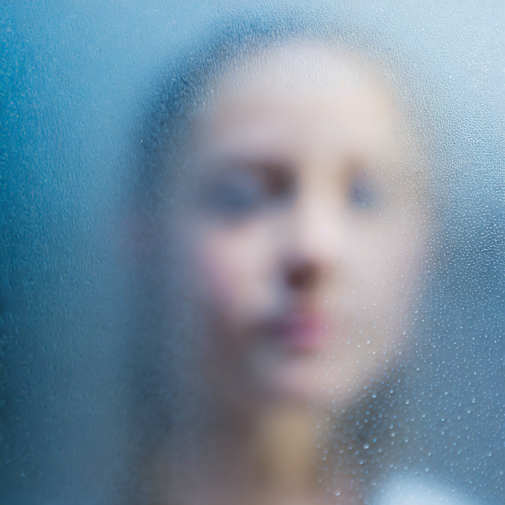

As an extreme visual learner, grasping concepts without a mental picture or a concrete example poses a significant challenge for me. Throughout my education, the majority of math learning materials overlooked the importance of providing visual interpretations, concrete examples, or relatable metaphors. This absence made understanding these concepts an uphill battle.

One common argument against emphasizing intuition in learning is the concern that it might compromise the rigor of the true mathematical form. A poorly crafted visualization or example could potentially lead to misunderstandings. However, I believe it's advantageous[^atest] to commence with Newton's laws, even though general relativity offers a closer approximation to reality.

[^atest]: test footnote

While the lack of visual explanations isn't solely responsible for my frustration, it's evident that as a visual learner growing up, I found myself in the minority. In a classroom where most students seemed to effortlessly grasp concepts, I often found myself as the sole voice expressing difficulty and seeking visual support.[^b]

[^b]: test 2 foot note

Today, I dived deep into diffusion models, and once again, I encountered the frustration of a lack of visual and down-to-earth explanations. This experience drives me to document my current understanding, with the goal of creating an example that showcases my ideal explanation—one that incorporates visuals and practical examples, illustrating how I believe this topic should be presented.

Let's consider the scenario where we aim to find a function that accurately defines a volume resembling a cow. Our aim is to visually render this cow by sampling points inside its volume and illustrating them. With a sufficient number of sampled points, we can effectively draw the intricate details of a cow.

However, as we're aware, discovering the precise mathematical formula for that cow function poses a considerable challenge. Yet, even without this exact formula, can we continue sampling points in it? Especially considering the thousands of known points that have already been sampled from the cow's volume?

Let's envision the cow as a balloon. If we heat the balloon, the air within it expands; the air molecules become more agitated, colliding with each other and the balloon's boundaries, resulting in increased inner pressure. If we persist, the balloon eventually assumes the form of a perfect sphere. Thankfully, we possess a precise mathematical formula for a sphere, simplifying the process of sampling points in its volume. Now, if we can mimic the inverse process—cooling down the cow-shaped balloon—we can reposition points from inside the sphere to inside the cow volume. Even without discovering the mathematical formula defining the cow's volume, this approach enables us to achieve the task of drawing the cow.

As we heat the balloon and its enclosed air molecules, their movement within a set time frame increases. Another perspective to explain this phenomenon is that we disrupt the initial positions of the air molecules by introducing a random offset.

Considering the air molecules as our sampled points, the inflation process essentially introduces randomness to their positions, while the deflating process works to diminish this randomness, aiming to restore their initial positions.

This encapsulates the essence of diffusion models. In this context, all images—whether artificial or natural—exist within a hyper-dimensional distribution. This distribution isn't limited to cow-like shapes but spans a magnitude of complexity far beyond.

Directly modeling this distribution is an impossible task. However, we possess an abundance of samples belonging to this distribution—our training images. Our objective is to simulate the inflation process by introducing noise to the sample images, causing the initial distribution to transform into a sphere—a Gaussian distribution. Subsequently, our aim is to task a neural network with learning the reverse step: transforming a sample from the Gaussian distribution back to one belongs to the original image distribution.

The reverse process resembles training an artist to create a clearer portrait while observing the model through frosted glass. The artist hones this skill by practicing drawing while observing millions of models, both behind and in front of a frosted glass, enhancing their ability to capture details despite the obscured view.

When presented with a data-point $x_0$ sampled from the actual data distribution $q(x) (x_0 \sim q(x))$, a forward diffusion process can be defined. This process involves adding Gaussian noise with variance $\beta_{t}$ to $x_{t-1}$, thereby generating a new sample $x_{t}$ governed by the distribution $q(x_{t} \mid x _{t-1} )$. This formulation of the diffusion process can be articulated as follows:

$$
  q(x_{t}|x_{t-1})= \mathcal{N}(x_{t}; \mu _{t} = \sqrt {1-\beta _{t}}x _{t-1}, \Sigma_{t} = \beta _{t} I)
$$

